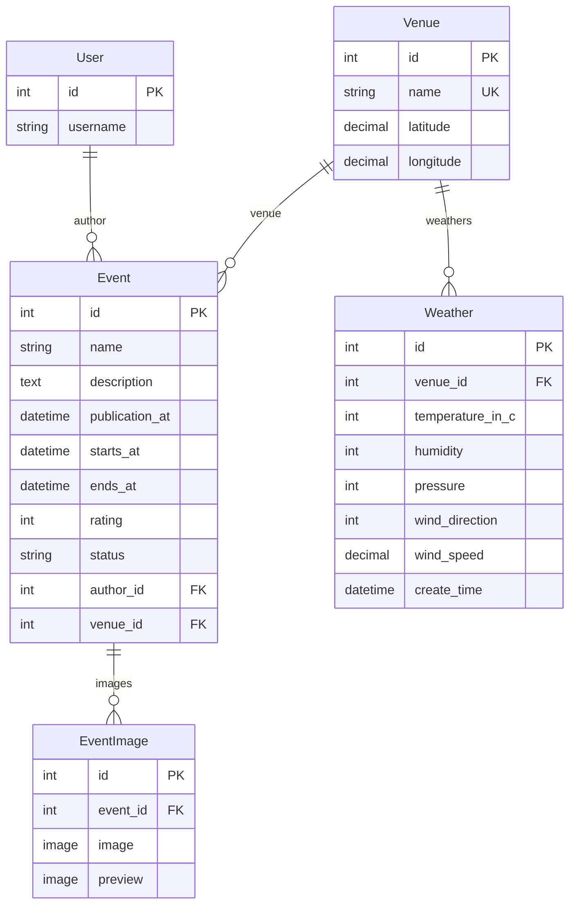

# Event Management API

Django-приложение для мест проведений и их мероприятий: CRUD, права доступа, импорт/экспорт xlsx, погода и фоновые задачи Celery.

## Используемый стек

- Python 3.14, Django 6.1, Django REST Framework
- PostgreSQL, Redis, Celery (worker + beat)
- drf-spectacular, django-filter, openpyxl, Pillow

## Реализованный функционал

- CRUD мест проведений.
  - Ограничения по правам: доступен только для суперпользователя.
  - Место проведения мероприятия хранит историю погоды. В read методах всегда возвращается актуальная (последняя) погода для этого места.
  - Обновление данных по погоде происходит асинхронно при создании, а также каждый час. 
- CRUD мероприятий. 
  - Ограничения по правам: создание/редактирование/удаление доступны только суперпользователю. Чтение в зависимости от статуса мероприятия (`draft/published` - суперпользователь. `published` - обычный пользователь).
  - Смена статуса происходит по `publication_at`: если время уже наступило - `published`, иначе `draft`.
  - Метод получения списка мероприятий поддерживает:
    - Фильтры: диапазоны `starts_at`, `ends_at`, `publication_at`, несколько мест (`venue`), диапазон рейтинга.
    - Поиск по названию мероприятия или места проведения.
    - Пагинация (max page size 100).
    - Сортировка по: названию, дате и времени начала проведения, дате и времени завершения проведения.
  - Мероприятие поддерживает загрузку нескольких изображений, также доступно превью-изображение, которое уменьшается до 200px по наименьшей стороне, если её размер превышает это ограничение.
- Импорт мероприятий из .xlsx файла
  - Ограничения по правам: доступен только для суперпользователя.
- Экспорт мероприятий в .xlsx файл
  - Ограничения по правам: доступен только для суперпользователя.
  - Фильтры: аналогичны фильтрации списка мероприятий.
- Выполнение периодических задач:
  - Получение погоды в местах проведения.
    - Реализовано отдельно приложение с моковым методом, который отражает реалистичный и разный результат.
    - Временной интервал: 1 раз в час.
  - Публикация мероприятий при наступлении даты и времени публикации.
    - При публикации мероприятия, добавляется таска в очередь об email рассылки.  
    - Временной интервал: каждую минуту.
  - Email рассылка при публикации мероприятия.
    - Настраиваемые опции: список адресатов, тема сообщения, текст сообщения.

## API

Базовый префикс: `/api/v1/`

| Метод | URL | Кто                                                                 |
|---|---|---------------------------------------------------------------------|
| CRUD | `/api/v1/venues/` | суперпользователь                                                   |
| CRUD | `/api/v1/events/` | запись - суперпользователь, чтение - зависит от статуса мероприятия |
| POST | `/api/v1/events/import/` | суперпользователь                                                   |
| GET | `/api/v1/events/export/` | суперпользователь                                                   |

Документация:

- Swagger UI: http://localhost:8000/api/docs/
- ReDoc: http://localhost:8000/api/redoc/
- OpenAPI schema: http://localhost:8000/api/schema/

Аутентификация - session / basic (стандартный DRF). Для проверки удобно создать суперпользователя и зайти через `/admin/` или Basic Auth в Swagger.

## Импорт и экспорт xlsx

Первая строка:

| Колонка |
|---|
| название |
| описание |
| дата и время публикации |
| дата и время начала проведения |
| дата и время завершения проведения |
| название места проведения |
| широта |
| долгота |
| рейтинг |

Экспорт поддерживает те же query-параметры фильтров, что и список мероприятий.

## Модель данных (ERD)

Диаграмма: [dbdiagram.io](https://dbdiagram.io/d/6aad0b36943b561dd47f70ed)



## Локальный запуск

Нужны PostgreSQL и Redis. Python 3.14.

```bash
python -m venv .venv
# Windows: .venv\Scripts\activate
# Linux/macOS: source .venv/bin/activate

pip install -r requirements.txt
cp .env.example .env
```

Приведите `DATABASE_URL` и `CELERY_BROKER_URL` в `.env` к своей локальной Postgres/Redis.

```bash
python manage.py migrate
python manage.py createsuperuser
python manage.py runserver
```

В отдельных терминалах:

```bash
celery -A core worker -l info
celery -A core beat -l info
```

Для тестов: `pip install -r requirements-dev.txt`, затем `pytest`.

## Docker

Docker Compose поднимает Postgres, Redis, миграции, API, Celery worker и beat. Свой `.env` не обязателен: в контейнеры подставляется `.env.example`, а хосты БД и брокера переопределяются на сервисы `db` и `redis`.

```bash
docker compose up --build
```

- API: http://localhost:8000
- Swagger: http://localhost:8000/api/docs/

```bash
docker compose exec web python manage.py createsuperuser
```

Код смонтирован в контейнеры (`.:/app`). После изменения задач Celery перезапустите `worker` и `beat`.
